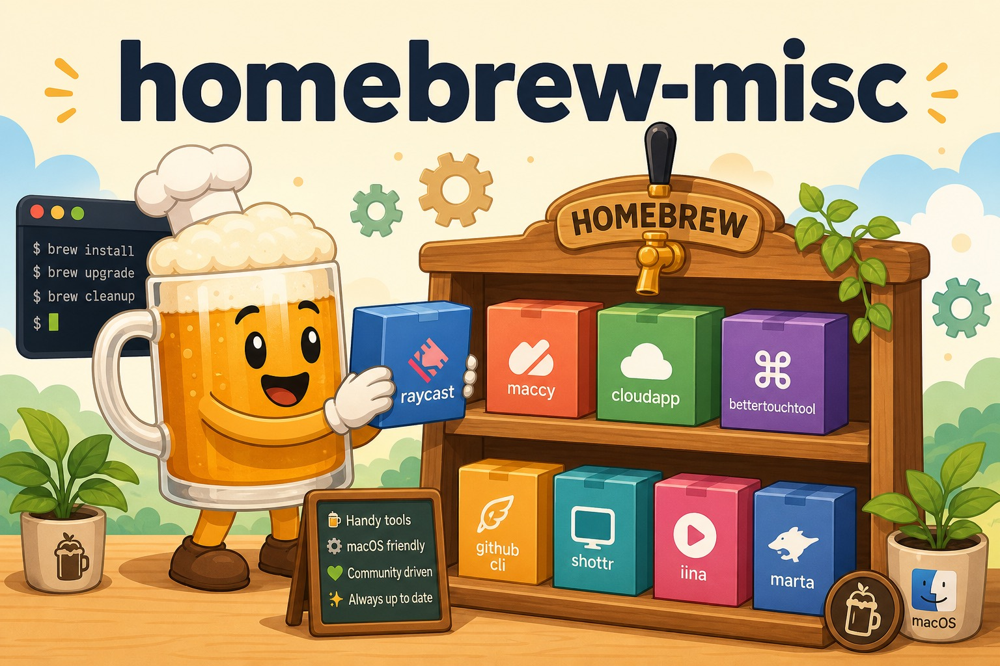

# homebrew-misc

   



A personal [Homebrew](https://brew.sh) tap collecting miscellaneous macOS cask definitions for apps that are not available in the official `homebrew/cask` repository — or that need a pinned/alternative version here.

## Installation

```sh
brew tap GeneralD/misc
```

Then install any cask from the tap:

```sh
brew install --cask <name>
```

## Available Casks

| Cask | App |
|---|---|
| `apk-installer` | APK Installer |
| `brush-pilot` | Brush Pilot |
| `consulo` | Consulo IDE |
| `ipa-installer` | IPA Installer |
| `itunes-converter` | iTunes Converter |
| `kakumaru-punch` | Kakumaru Punch |
| `kensington-works` | KensingtonWorks |
| `myjoystick` | MyJoystick |
| `ql-procreate-viewer` | QuickLook Procreate Viewer |
| `stability-matrix` | Stability Matrix |
| `tune4mac-itunes-video-converter-platinum` | Tune4Mac iTunes Video Converter Platinum |
| `unity-package-unpacker` | Unity Package Unpacker |
| `unity-version-selector` | Unity Version Selector |
| `vroid-studio` | VRoid Studio |
| `xm-mt4` | XM MetaTrader 4 |
| `xm-mt5` | XM MetaTrader 5 |

## Project Structure

```text
Casks/   # one Ruby cask definition per app
```

## Notes

- Most casks use `sha256 :no_check` because the upstream download URLs are unversioned or change without notice.
- Casks were migrated here from a private tap.
